  **[(日本語は下にあります)](https://github.com/tmhtdst0508-ux/KENZEN-SeaArt-Helper#kenzen-seaart-helper-%E3%81%B8%E3%82%88%E3%81%86%E3%81%93%E3%81%9D)**

\[Notice\] This tool runs on Excel Macro (VBA). It requires a Windows/Mac PC environment to unleash its full power. Sorry, prompt mages on mobile, this "forbidden door" requires a desktop key! 💻

\[注意\] 本ツールは、Excelマクロ(VBA)です。 動作のためには、Windows/Mac PCが必要です。モバイル術士の皆様には申し訳ないのですが、「禁断の扉」を開けるには、「デスクトップ環境」というキーを入手してください。 💻

* * *

# Welcome to the KENZEN SeaArt Helper! 🤝

Greetings to all fellow AI Mages in Japan and across the world who strive for "KENZEN" (Wholesome™/NSFW) art!

I am Tomohito Fujikawa (aka "Dst" or "Deeste"). I am a writer who has spent approximately 15 years on the front lines of over 60 PC eroge (Visual Novel) titles, weaving scenarios and situations. In my pursuit of the ultimate "KENZEN (NSFW)" AI illustrations, I hit a wall: "I need a system to manage my deep-seated karma (fetishes) and complex prompts more intuitively and safely."

That is exactly why I forged this tool for my comrades (read: you degenerates). The KENZEN SeaArt Helper is the ultimate cockpit for AI mages wielding SeaArt and Stable Diffusion.

**How to Download**

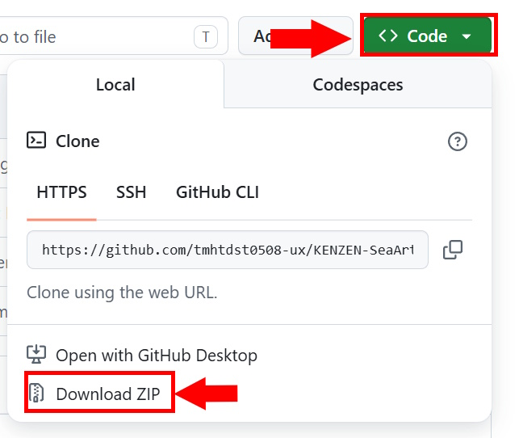

**How to Unlock** `.xlsm`

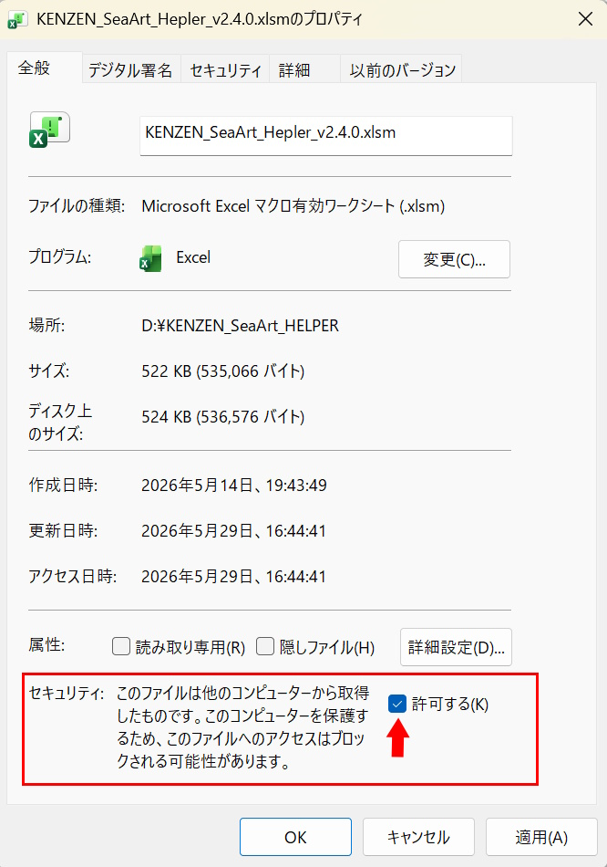

**Screenshot**

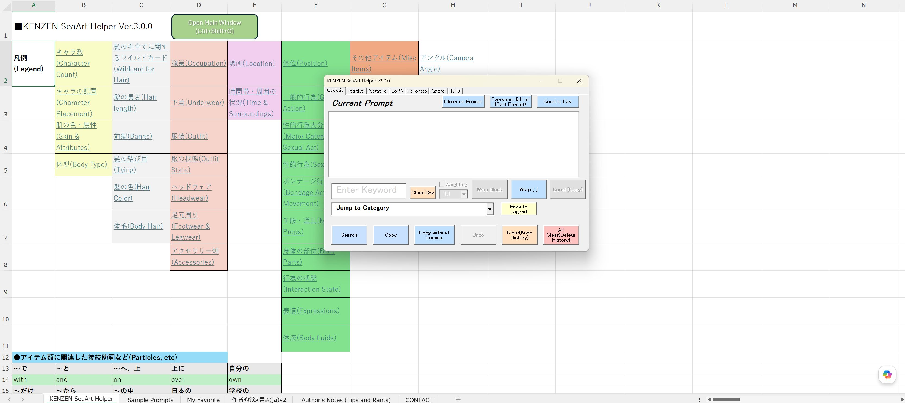

# 🚀 【v3.1.0 Released!】 🚀

## The "NUKE!" Button Has Arrived!
Let's be real—after modifying prompts and piling up custom settings for a while, you eventually look at your database and think, "What the hell did I even do here?" Source: Me. When that inevitable moment of chaos hits and you just want a clean slate, I've got you covered. Wielding this newly forged "NUKE! (All Reset)" button will instantly wipe the floor and restore every single setting, LoRA, and favorite back to its pristine factory default.

## Bug Fixes & Architecture Fortifications:
I've successfully tracked down and squashed three critical bugs regarding prompt manipulation:

1. Prompt Sort Algorithm Overhaul:
   Significantly improved the sorting logic to handle advanced prompt engineering. The parser now effortlessly crawls inside complex, interconnected strings and automatically inherit proper sorting scores without breaking your spell's integrity.

2. Fixed the Ghost LoRA Export Bug:
   Resolved a silent caching issue where "LoRA-Specific Negative Prompts" were completely skipped and left behind during the JSON export process. Your custom negative backups are now 100% complete and safe.

3. Fortified the Negative Preset Parser:
   Fixed a traditional parsing trap where multi-word tags bound together by custom weights—like `(worst quality, lowres, jpeg artifacts:1.2)`—would cause the list box expansion to completely fall apart. The tool now runs a sophisticated nesting parser to keep your heavy-weight curses perfectly intact.

Honestly, my bad for missing these. *Deep bow of apology (Dogeza)* 🙇‍♂️

If this tool aids you in your glorious creative journey, hitting that ⭐Star on the repository would be the ultimate encouragement for the author! Let's spread the "KENZEN" culture together!

# ■ KENZEN SeaArt Helper Manual (v3.1.0)

_Prefer offline reading? [Download the PDF Manual here!](KENZEN_SeaArt_Helper_Manual_v3.1.0.pdf)_

**TL;DR**: This is a tool hyper-specialized in building and managing NSFW generation prompts for SeaArt (& Stable Diffusion). You can also use your API key to have Gemini brainstorm NSFW prompts for you.

## 1\. Introduction

This Excel workbook uses macros.  
Coding Assistance: Google Gemini (basically I outsourced the actual implementation to it).  
Transparency: Press Alt+F11 to open the VBA Editor and inspect/mod the MainCode in the Standard Modules. (\*No malicious backdoors are hidden here, just some spaghetti code brewed up by following Gemini's every word.\*)  
Copyright: I don't waive it, but you are free to mod and redistribute. No need to report to me (though I'd be happy if you did).

## 2\. Purpose

Developed to dramatically hyper-optimize "NSFW-focused" prompt creation on SeaArt. This is an English prompt-building tool designed to accurately convey your intent to the AI. I packed it with my passion and fetishes to make "something easy for me to use!" Avoid the pitfalls of "Bad English" and take the shortest route to your ideal output. ...It's totally! Wholesome™ (KENZEN)!

## 3\. Core Macro Features (Safety Design)

3-1 Full-width check  
If Japanese (full-width characters) is included, the copy halts and a warning sound plays.

3-2. Auto-concatenate  
From the second copy onward, it automatically inserts ", " (comma + half-width space) and appends.

3-3. Real-time display  
The prompt under construction is constantly displayed in the "Current Prompt" field.

3-4. Reset feature  
The Clear button wipes the clipboard and screen display.

## 4\. Preparation

4-1 Unblock  
Right-click the downloaded .xlsm file -> Properties -> Check "Unblock" and save.

4-2 Enable Macros  
Open the file and click "Enable Content" at the top.

4-3 Regarding the JSON file  
Make absolutely sure the included `KENZEN_Config.json` is placed in the exact same folder as the .xlsm file.

## 5\. Search Panel & Operation

When you boot it up (enable macros), the main window opens. If KENZEN_Config.json is missing from the folder or corrupted, a new one will be generated. Even if you close the main window with the X in the top right, you can always reopen it via "Open Main Window" or the shortcut `Ctrl + Shift + O`. You can also minimize it and banish it to the bottom-left corner of your desktop. Because when you're browsing a massive database, the window gets in the way, right?

The window consists of 7 tabs (panels): Cockpit, Positive, Negative, LoRA, Favorite, Gacha!, and I/O.

### 5-1 "Cockpit" Tab

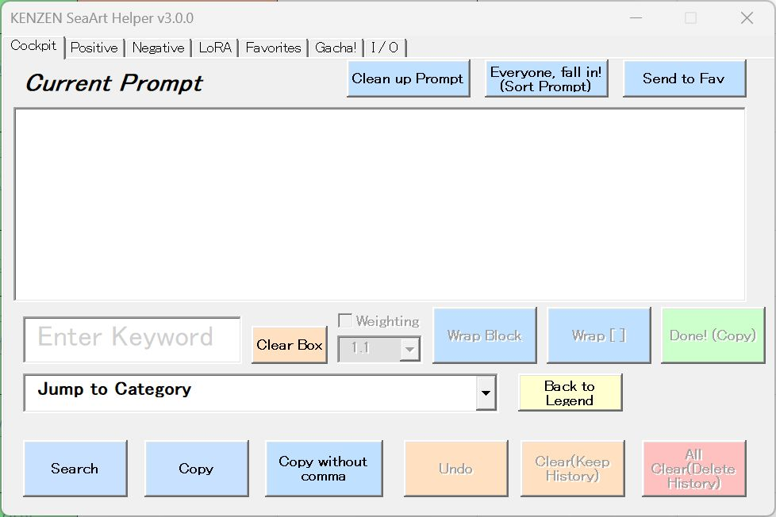

The tab containing the menu to build your prompts.  
**5-1-1. "Current Prompt"**: Displays the current contents of the clipboard. Every time you copy a prompt, it gets appended here. Since it's a text field, manual tweaks are possible.  
**5-1-2. Search Box (Enter Keyword)**: Input a keyword and hit Enter or click "Search" to search the main sheet. Upon a hit, the cell glows yellow and jumps to the prompt cell on its right. If you search in English, it stays put. On consecutive hits, press Enter to loop to the next result.  
**5-1-3. "Jump to Category" Combo Box & "Back to Legend" Button**: A dropdown to jump to the heading cell of each category. At the end of the item columns, there's a "Return to Legend" hyperlink, but if you think "Scrolling down is a pain!", just hit "Back to Legend" to return to the legend.  
**5-1-4. "Copy" Button**: Click on a prompt cell you want to copy, and it gets sent to the clipboard. Repeated copying accumulates prompts in the "Current Prompt" field, separated by ", ". "BREAK" is special and gets line breaks before and after. Plus, if the clipboard gets locked for some reason, it's designed to retry.  
**5-1-5. "Copy without comma" Button**: Concatenates without a comma (just a space). Useful for combining concepts like "oversized tank top". The macro adds a comma and space to the start of copied words (except the first one). So for "`1 girl is going to the park with me`", you'd normal copy "`1 girl`", comma-less copy "`is going to`", comma-less copy "`park`", comma-less copy "`with`"... until the word where you actually want a comma next. Then just normal copy the next prompt. Note: even if you click this for the very first prompt, it won't add a space at the start.  
**5-1-6. "Undo" Button**: Reverts the operation. Up to 50 times. The clipboard contents revert too.  
**5-1-7. "Clear" Button**: Wipes the clipboard and "Current Prompt" field. Undo is possible.  
**5-1-8. "All Clear" Button**: Completely wipes the clipboard, "Current Prompt" field, and ALL history, resetting everything. Undo is NOT possible. (Aka: The Nuke button)  
**5-1-9. Weighting Feature ("Weight" Checkbox & "Wrap Block" Button)**: You can assign weights from 0.5 to 1.3 to prompts you want to emphasize (or weaken). Works for single words, or combos like "(oversized tank top:1.1)". Hitting "Wrap Block" wraps the block up to the previous comma in "()" and weights it. Works for single prompts too. To prevent misclicks and reduce AI load, the checkbox turns off once you click the Weight button. If you turn the check back on and click "Wrap Block" without adding a prompt, the weighting is removed.  
**5-1-10. "Wrap \[ \]" Button:** When using the BREAK syntax, wrapping entire character elements in "\[\]" improves AI comprehension (might depend on the model). Select a range in the text box and press this button to wrap that block in "\[\]".  
**5-1-11. "Done!" Button**: Once you're satisfied with your manual tweaking, click "Done!" to copy the current text field contents.  
**5-1-12. "Everyone, Fall in! (Sort Prompt)" Button**: When building long incantations, it's easy to "forget an element." The AI understands even if the order is a mess, but it's better if it's organized. Hit this to sort your prompt according to the database item order. Note: If you use the BREAK syntax, it only applies to the final paragraph.  
**5-1-13. "Cleanup Prompt" Button**: While trial-and-erroring your spells, garbage like extra commas tends to slip in. It won't cause fatal errors, but it's not beautiful. Press this button to scrub the unnecessary commas out of your spell.  
**5-1-14. Send to Fav Button**: Sends a prompt you like to the text field in the "Favorite" tab window.

### 5-2. "Positive" Tab (The AI only does what it's told)

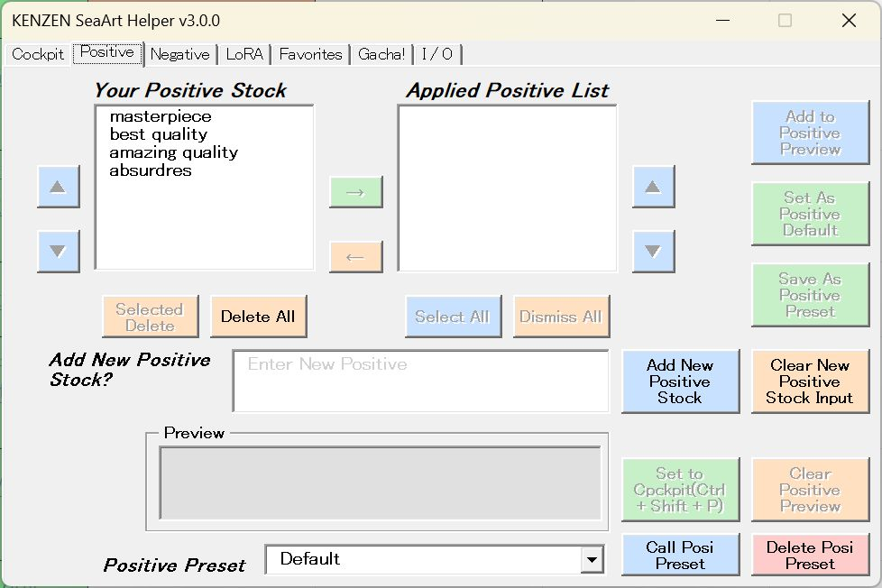

A dedicated screen to efficiently manage and deploy Positive Prompts to make the fundamentally lazy AI actually work.  
**5-2-1. Your Positive Stock**: The list box on the left. Lists currently registered positive prompts. Comes with a default set. You add, subtract, divide, and multiply(?) these. Multi-selection via Ctrl/Shift or mouse drag is supported.  
**5-2-1-1. Selected Delete Button**: Deletes the selected items from the stock data. The source data goes poof too.  
**5-2-1-2. Delete All Button**: Nukes the entire stock. Beware, the source data is completely wiped.  
**5-2-2. Applied Positive List**: The list box on the right, home to the elite troops(?) you want to output as positive prompts. Also multi-selectable.  
**5-2-2-1. Select All Button**: Selects everything in the list. Useful for sending them all to the preview field at once.  
**5-2-2-2. Dismiss All Button**: Rejects (clears) all words you intended to apply. Doesn't affect the source data.  
**5-2-3. ▲/▼ Buttons**: Buttons next to the two list boxes. As they look, they sort the order in the lists. To prevent errors, they move one at a time. The left stock changes the source data order, the right does not.  
**5-2-4. →/← Buttons**: As they look. "→" sends selected items from the stock to the applied list, "←" returns (dismiss) intended words. Doesn't affect source data.  
**5-2-5. Add to Positive Preview Button**: Sends selected tags to the "Preview" text box at the bottom. Multi-selections are output separated by ", ".  
**5-2-6. Set as Positive Default Button**: Registers the Preview window contents as the default positive prompt.  
**5-2-7. Save as Positive Preset Button**: Registers the Preview window contents as a preset.  
**5-2-8. Add New Positive Stock? / Add New Positive Stock Button / Clear Positive Stock Input Button**: To register a new positive prompt, input it here and press Enter or the "Add New Positive Stock" button to add it to the left stock list. It formats and registers comma-separated, tab-separated, or line-break-separated inputs. Clear Positive Stock Input simply wipes the text box.  
**5-2-9. Preview Box**: As mentioned, displays the actual positive prompt. Direct manual editing is allowed.  
**5-2-10. Send to Cockpit Button / Clear Positive Preview Button**: Transfers the positive prompt in the Preview to the main text window of the Cockpit. You can also do this via the shortcut `Ctrl+Shift+P`. Throwing an error if the Preview is empty. Clear Positive Preview wipes the Preview window.  
**5-2-11. Positive Preset Combo Box / Call Posi Preset Button / Delete Posi Preset Button**: Select a registered positive prompt preset from the dropdown and hit "Call Preset" to summon it. You can delete them with Delete Posi Preset, but you can't delete the Default.

### 5-3. "Negative" Tab (The Absolute Blacklist)

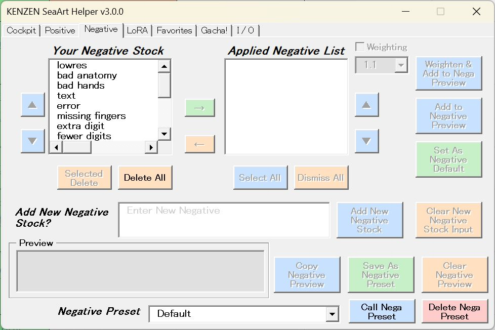

A dedicated screen to manage and deploy Negative Prompts to halt the AI's "rampage." Basically symmetrical to the Positive prompt screen, but with minor differences.  
**5-3-1. Your Negative Stock**: The list box on the left. Lists currently registered negative prompts. Comes with a default set.  
**5-3-1-1. Selected Delete Button**: Deletes selected items from the stock. Source data dies too.  
**5-3-1-2. Delete All Button**: Like the positive side, nukes the entire stock.  
**5-3-2. Applied Negative List**: Same as the positive side.  
**5-3-2-1. Select All / Dismiss All Button**: Same as the positive side. (Ditto below)  
**5-3-3. ▲/▼ Buttons**: (Ditto)  
**5-3-4. →/← Buttons**: (Ditto)  
**5-3-5. Add to Negative Preview Button**: (Ditto)  
**5-3-6. Weighting Checkbox, Combo Box, Weighten and Add to Nega Preview Button**: Just like the Cockpit, turning on the checkbox opens a combo box, allowing you to weight negative prompts from 0.5 to 1.3.  
**5-3-7. Add New Negative Stock? / Add New Negative Stock Button / Clear New Negative Stock Input Button**: Don't make me explain the same thing again! (Sudden rage)  
**5-3-8. Preview Box**: Needs no explanation.  
**5-3-9. Copy Negative Preview / Clear Negative Preview Button**: Copies the negative prompt in the text box to the clipboard, or clears the Preview box.  
**5-3-10. Negative Preset Combo Box / Call Nega Preset Button / Delete Nega Preset Button**: Same as the positive side.

### 5-4. "LoRA" Tab (The LoRA Forge)

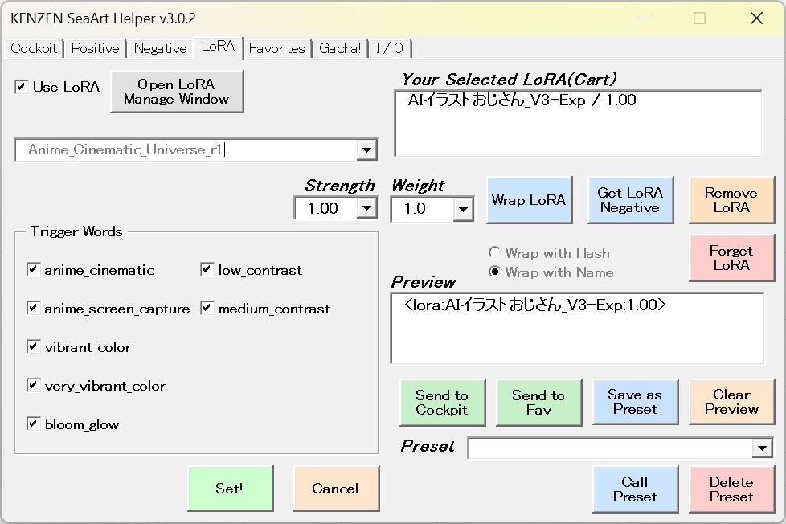

Visually and intuitively builds and manages the combination of &lt;lora:hash(sys name):strength&gt; prompts and their accompanying trigger words, which are essential for quality improvement. (If no LoRA is registered, the UI is locked for safety. Please register LoRAs from the "Open LoRA Manage Window".)  
**5-4-1. Use LoRA Checkbox**: Toggles the functionality of this tab on/off.  
**5-4-2. Open LoRA Manage Window Button**: Opens a dedicated window (explained later) to register and manage LoRA system hashes and trigger words.  
**5-4-3. LoRA Selection & Strength**: Select a registered LoRA from the dropdown. Upon selection, the recommended strength and registered trigger words are automatically deployed.  
**5-4-4. Trigger Words Checkboxes**: Check only the deployed trigger words you want to use this time (user-friendly design: they all default to ON). LoRAs without trigger words won't show anything here.  
**5-4-5. Set! & Cancel Buttons**: "Set!" puts the selected LoRA and trigger words into the right list box (cart). "Cancel" resets the selection to blank.  
**5-4-6. Your Selected LoRA (Cart)**: The list of currently set LoRAs. If you want to stack multiple LoRAs, simply select another one and hit "Set!" to keep adding them.  
**5-4-7. Wrap LoRA! Button & Weight (Prompt Alchemy)**: Formats the "selected LoRA's" trigger words in the cart into the &lt;`lora:Hash(sys name):strength`&gt;,(Trigger word:1.x) format and outputs it to the Preview field. If the trigger word weight is 1.0, it won't be wrapped in "()". However, if you want to "give different weights to multiple trigger words of the same LoRA," please edit the Preview text box manually.  
***Safety Feature***: In the unlikely event that a "Ghost LoRA" deleted from the main management data remains in the cart, it will automatically detect and exorcise (delete) it the moment you press this button.  
**5-4-7-1. Wrap with Hash / Wrap with Name Option Buttons**: When shaping the selected LoRA into the &lt;`lora:...`&gt; format, you can choose whether to wrap it with the hash value or the system name. Implemented because SeaArt prefers hashes, while SD WebUI prefers names.  
**5-4-8. Get LoRA Negative Button**: If you select a LoRA with inherent negative prompts within the list, this becomes clickable, deploying that LoRA's negative prompt to the Preview field of the "Negative" tab.  
**5-4-9. Remove / Forget LoRA Buttons**: "Remove" kicks the selected LoRA out of the list. "Forget" completely clears the cart and preview so you can start over.  
**5-4-10. Send to Cockpit / Send to Fav / Clear Preview Buttons**: Transfers the completed LoRA prompt in the Preview field to the text field of the Cockpit or Favorites tab. Clear Preview simply clears the Preview text box.  
**5-4-11. Preset (Save & Call Presets)**: "Save as Preset" lets you name and save your current LoRA combo (list contents and weights). "Call Preset" summons it instantly anytime, and "Delete Preset" deletes it. Saving combos of frequently used outfits or art styles dramatically reduces workflow time.

### 5-5. "LoRA Register & Manage" Tab (The LoRA Vault)

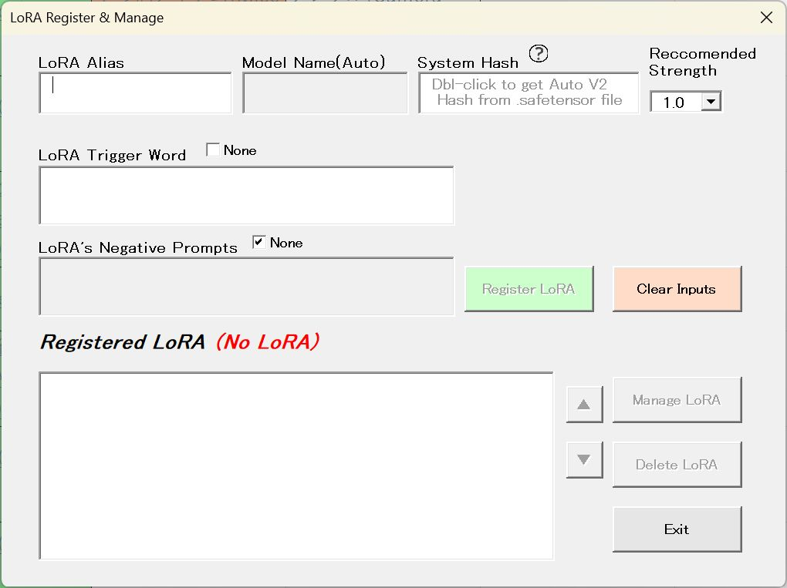

The heart of the operation where you register and manage actual LoRA data (hash values, trigger words, inherent negative prompts). Accessed via "Open LoRA Manage Window" from the "LoRA" tab.  
**5-5-1. LoRA Alias / Model Name / System Hash / Recommended Strength**:  
\- Alias: Any name you can easily identify (e.g., JK Uniform, Watercolor Style).  
\- Model Name: The official system name of that LoRA, fetched from the file when you load a .safetensors file. Auto-populated, cannot be edited.  
\- System Hash: The actual hash value used in SeaArt, etc. Double-clicking the field opens a `.safetensors` file reference window; specifying the LoRA file auto-fetches the AUTO V2 format hash value!  
\- Note: What's a hash value in SeaArt? When you open the detail page for a LoRA on the SeaArt site, look at the URL: https://www.seaart.ai/models/detail/40095be8759dde4285ccf683b24e8852.

In this example, the string after /detail/, 40095be8759dde4285ccf683b24e8852, is the hash value.  
\- Recommended Strength: The recommended strength value for that LoRA.  
\- Auto-Sanitize: An ironclad guard is stationed here; even if you input full-width characters or invalid symbols into the Hash field, it automatically purifies them into safe half-width characters.  
**5-5-2. LoRA Trigger Word / None Checkbox**: Input the trigger words to activate that LoRA. Multiple words can be input separated by commas.  
Note: Max 10 trigger words. A case-insensitive duplication check is performed, and symbols harmful to prompts (! ? @ # ( ) etc.) are rejected with an error. If a LoRA doesn't need a trigger word, check "None".  
**5-5-3. LoRA's Negative Prompts Field / None Checkbox**: If a LoRA has inherent negative prompts, you can register them all at once. Registered prompts can be called up via the "Get LoRA Negative" button on the "Negative" tab of the main window.  
**5-5-4. Register / Cancel / Update LoRA Buttons**: Registers the input contents. While you are editing (Managing) an existing LoRA—say, adding or removing trigger words—the button morphs into "Update LoRA". A dirty check feature prevents pointless overwrites if nothing changed.  
**5-5-5. Registered LoRA List & Sort Buttons (▲ / ▼)**: A list of registered LoRAs. Use the "▲" and "▼" buttons to freely organize the list, like pushing your favorite LoRAs to the top or sorting them by category. The order here links to the dropdown in the main screen.  
**5-5-6. Manage / Delete LoRA Buttons**: Edits (Manage) or completely deletes (Delete) the selected LoRA from the list.

### 5-6. "My Favorite" Tab (The Fetish Vault)

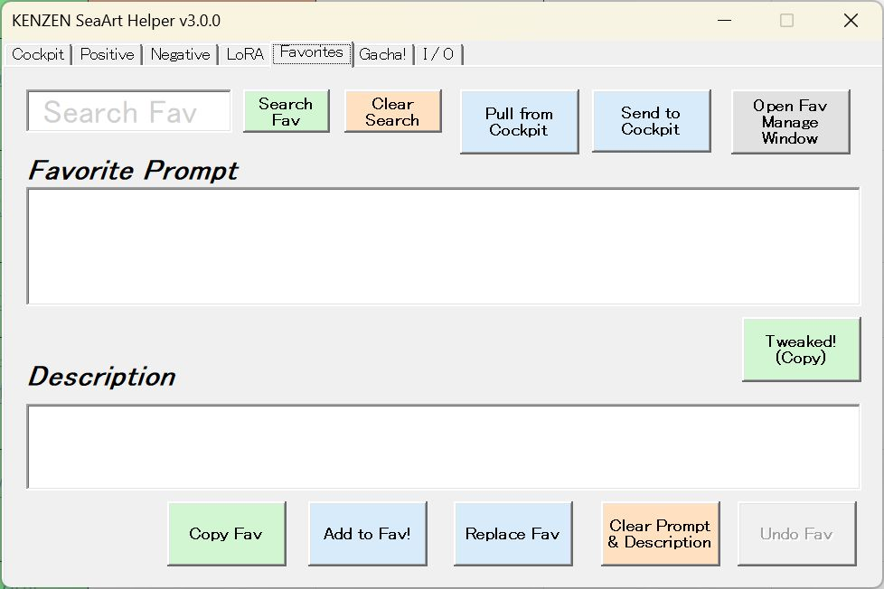

The tab housing menus to manage your precious prompts, forged after much painstaking effort(?). Note: None of the buttons on this tab will work unless the "My Favorite" tab is active.  
**5-6-1. "Search Fav" Field, "Search Fav" Button & "Clear Search" Button**: Input a keyword and hit Enter or click "Search Fav" to search within the "My Favorite" sheet. It only searches the "Description" field, glowing the hit cell like the main sheet, and looping on multiple hits. Clear Search simply wipes the search box.  
**5-6-2. "Pull From Cockpit" Button**: Transcribes the prompt inputted in the "Cockpit" tab's text field.  
**5-6-3. "Send to Cockpit" Button**: The reverse of the above; sends the Favorite Prompt text field contents to the Cockpit's field. Use this to further brush up a favorite by adding prompts from the main sheet.  
**5-6-4. "Open Favorite Manage Window" Button**: Opens the favorite management window (explained later).  
**5-6-5. "Copy Fav" Button**: Copies a favorite on the "My Favorite" sheet. You know, you wanna use those perfect spells over and over again. The copied spell (prompt) is displayed in the text field along with its description. (Almost no one could remember a spell just by looking at it without a description, right?)  
**5-6-6. "Tweaked!" Button**: After manually adjusting the copied favorite prompt within the text field, this becomes clickable; clicking it copies the text field contents.  
**5-6-7. "Add to Fav!" Button**: Registers the prompt in the field to the "My Favorite" sheet. If the "Description" is blank, it spits out an error. Max 50 items can be registered.  
**5-6-8. "Replace Fav" Button**: Replaces the prompt of the focused cell in the "My Favorite" sheet with the contents of the text field (if the cell is blank, it just inputs it). Spits an error if you click on a cell with no prompt. Useful when you think, "I added a new element to a Fav prompt and it got way better! But I don't want similar dupes cluttering my favorites!"  
**5-6-9. "Clear Prompt & Description" Button**: Simply clears the prompt and description fields.  
**5-6-10. "Undo Fav" Button**: Like the Cockpit, undoes the text field contents.

### 5-7. Favorite Manage Window (Organize your collection)

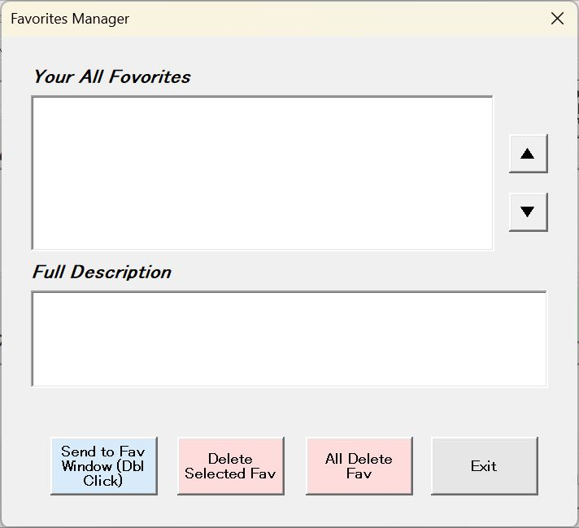

The window to manage your registered favorites.  
**5-7-1. Your All Favorites List Box / ▲▼ Buttons**: All favorites are listed. Sort them with the ▲▼ buttons.  
**5-7-2. Full Description Box**: Displays the full description of the favorite selected in the list.  
**5-7-3. "Send to Fav Window" Button**: Sends the selected favorite to the text field in the Favorite tab. Double-clicking inside the list does the exact same thing.  
**5-7-4. "Delete Selected Fav" Button**: Deletes the selected favorite(s). Multi-selection is supported.  
**5-7-5. "All Delete Fav" Button**: Deletes all favorites. Point of no return, so be extremely careful.

### 5-8. "Gacha!" Tab (AI Auto-Pilot Prompt Alchemy)

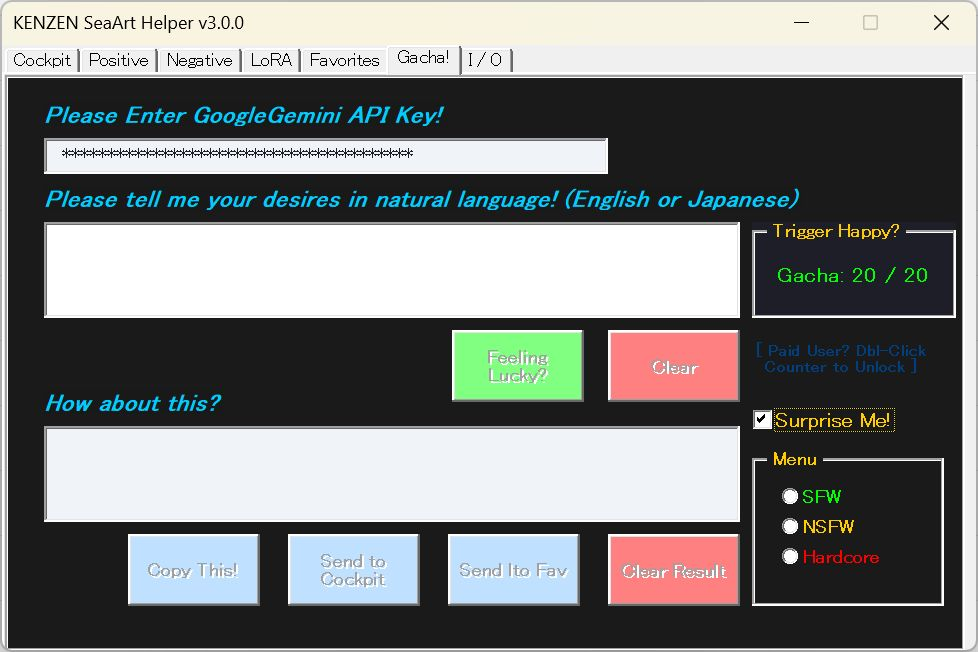

An automated prompt generation feature powered by the Google Gemini API. When you are absolutely sick of building dense and complex spells (prompts), surrender yourself to the AI's imagination as a "pure breather." It's literally a "Gacha" of "What will pop out?". By the way, I've cast some magic (exaggeration) on Gemini, so it will reliably forge NSFW prompts for you. However, there are some "instant death" landmine words. See the "Author's Notes v3.0.0" sheet in the workbook for details.  
**5-8-1. Google Gemini API Key**: To use the AI generation feature, you must acquire an API key from Google AI Studio and input it here.  
**Not Supported**: I provide ZERO individual support regarding how to acquire or set up the API key. Please only use this if you are a "Mage" capable of figuring it out yourself.  Let’s be real here—I’m a writer, not your personal IT support! 
**AI's Mood**: Google Gemini is a very "well-mannered" AI. No matter how much it CAN output NSFW prompts, depending on the content or the AI's "mood (safety filter)" (which sometimes aggressively flexes its service spirit), the output might fail or get outright rejected. Please enjoy it as a "Gacha" inclusive of these quirks.  
**Auto-Save API Key**: Once prompt alchemy via Google Gemini succeeds, using that as a flag, the inputted API key is recorded in your local machine's registry and will be auto-filled from the next time. If your API key changes, overwrite it, and it will save upon the next successful execution.  
**5-8-2. Natural Language Input Field (Please tell me your desire!)**: Freely input the situation (desire) you envision using your everyday words.  
Bilingual Support: Even if it's Japanese, English, or a mix of both, the AI will understand the context and elevate it into optimal tag sets for generative AIs like SeaArt.  
**5-8-3. Operation Buttons:**  
**Feeling Lucky?**: Sends a request to Gemini based on your input and rolls the gacha. Error responses also count against your API limits, so excessive spamming leads to errors = wasting your ammo. Therefore, once pressed, it grays out for 15 seconds. Incidentally, during that time, to prevent misclicks, you can't move to other tab windows either. It's not a bug, it's a feature (the ancient mantra).  
**Clear**: Clears the input field contents.  
**5-8-4. Generation Result Area (How about this?)**: Displays the prompt forged by the AI.  
Copy This!: Copies the generated prompt to the clipboard.  
Send to Cockpit / Send to Fav: Transfers the generated prompt to the "Cockpit" or "Favorites" tab. Apply your favorite LoRAs or whatever your heart desires.  
Clear Result: Wipes the generation result.  
**5-8-5. "Trigger Happy?" Frame (Remaining Gacha Ammo)**: Displays the remaining number of gacha executions for the day.  
Just an Estimate: The displayed count is an "estimate" based on typical Google free-tier API limits and internal tracking within this tool. There may be slight discrepancies with actual Google API limits.  
**Reset**: The count resets at midnight Pacific Time (PT).  
**Limit Adjustment (Hidden Feature)**: If you are a heavy user paying for the API and want to change the limit setting, double-click the number part of the counter. An input box will appear allowing you to freely adjust the daily limit.  
**5-8-6. "Surprise Me!" Checkbox / SFW & NSFW & Hardcore Option Buttons**: Checking this reveals 3 option buttons. Pick one and hit "Feeling Lucky?", and Google Gemini will brainstorm a prompt for you based on randomly extracted words from the database.  
***Tips:*** Gacha Tricks: When describing your desires, there's no need for you to be "well-mannered". During debugging, there were cases where if you showed weird bashfulness, Gemini sensed it and activated its (smart-ass) safety filter. That's right. If you mean female genitalia, you don't need to sugarcoat it as "crotch". Just be honest and write "p\*\*\*y".

### 5-9. "I/O" Tab (Safeguard your assets properly)

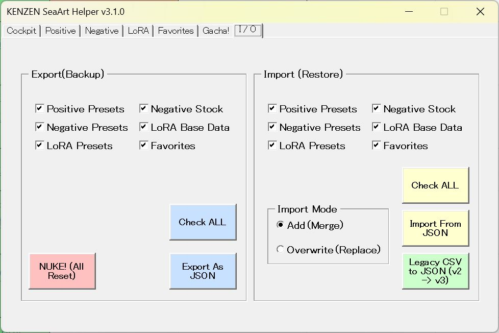

A centralized tab bringing together features to backup (Export) or restore (Import) your painstakingly amassed prompt assets in JSON format.  
- Positive Preset  
- Negative Stock  
- Negative Preset  
- LoRA Base Data  
- LoRA Preset  
- Favorite

The above 6 data types are targeted. By default, all are checked, but hitting "Check All" toggles between unchecking all and selecting all. Export with "Export as JSON", import with "Import from JSON". Just like it says!  
**5-9-1. Add(Merge) / Overwrite(Replace) Option Buttons**: Choose whether to append (merge) to existing data or overwrite (replace) it. Furthermore, when importing Favorites in Add mode, anything exceeding the 50-item limit can be salvaged into a separate JSON file.  
**5-9-2. "Legacy CSV to JSON" Button**: A feature for those who were using up to V2.x. Converts Favorite and LoRA CSV files created in older versions into JSON files usable in v3.x.
**5-9-3. The "NUKE! (All Reset)" Button**:This triggers a complete factory reset, wiping the floor and restoring every single piece of data back to its default state. Because this physically overwrites your entire database, features like "Undo" will NOT save you here. Treat this button with extreme respect—once you push it, there is no turning back. You have been warned!
## 6\. Prompt Construction Flow

Simply select the pale green cells from left to right, and you'll have a completed prompt.  
Character Count → Character Placement → Skin & Attributes → Body Type → Wildcard For Hair → Hair length → Bangs → Tying → Hair Color → Body Hair → Occupation → Underwear → Outfit → Outfit State → Headwear → Footwear & Legwear → Accessories → Location → Time & Surroundings → Position → Action & Movement → Bondage Action & Movement → Means & Props → Body Parts → Interaction State → Expressions → Body fluids → Misc Items → Camera Angle → Censorship Fixes & Others  
If you are using the Dynamic Prompt extension in a local Stable Diffusion environment, wildcards are provided for hair, expressions, and camera angles. They are bundled in the ZIP file, so please make use of them.  
At the top of the main sheet, hyperlinks are set to jump to each item's cell. Clicking them jumps to the cell, and the focused cell is automatically pushed to the left edge of the window.

## 7\. "Sample Prompts" Sheet

A collection of the author's favorite situations. Full disclosure of my fetishes! (Insane). Copying a sample simultaneously transfers it to the text box in the "Cockpit" tab window, so you can tweak it to craft your own original prompt.

## 8\. "Author's Notes v3.1.0" Sheet

Contains tips regarding prompts and tales of my struggles while making this macro. Read it when you need a break(?).

## 9\. "CONTACT" Sheet

As written in this README, contains the author's contact blog, etc.

## 10\. Disclaimer & Contact

Generation results are entirely up to the AI. The author assumes ZERO responsibility for any damages caused by using this tool. Likewise, the "Gacha!" feature does not guarantee a successful NSFW output. AI results are unpredictable. I am not responsible for what you generate.  
 - Tested Model: [REED_XXX_illustrious_SDXL V14.0](https://civitai.red/models/1717562/reedxxxillustrioussdxl)  
 - Author: Tomohito Fujikawa (aka "Dst" or "Deeste" / Former Eroge (Visual Novels) Writer).  
 - Contact/Blog: [dsblog.biz](https://dsblog.biz/)  
 - Bug reports are great, but [PayPal tips](https://paypal.me/dst0508) keep the lights on!  
 - While bug reports are absolutely welcome, what I really crave are your missing tag requests! Hit me with feedback like, "Hey, you forgot this location!" or "Where the hell is this specific outfit?!" Sure, you have the freedom to mod the code and add them yourself, but please share them with me—because I too wish to gaze upon uncharted scenarios! Your collective wisdom is the fuel that makes this macro even more totally KENZEN (Wholesome™)!  
 - (Bonus) Craving some Lore? On [my personal SeaArt page](https://www.seaart.ai/ja/new-user/4b23d22e331a382c4adc23a3df4e7077), I post original short stories based on the generated illustrations. Feel free to check them out if you like.

Now! Enjoy your KENZEN AI Life! 😊

* * *

# KENZEN SeaArt Helper へようこそ！🤝

**日本の、そして世界中の「****KENZEN****」なる同志たる****AI****術師の皆様、ようこそ！**

不二川巴人（ふじかわ ともひと。あるいは「でぇすて」）と申します。約15年間にわたり、60タイトル以上のPC美少女ゲームの最前線で、シナリオやシチュエーションを紡いできた物書きです。究極の「KENZEN（NSFW）」なAIイラストを追い求める中で、一つの壁にぶち当たりました。それは、「己の深淵なる業（フェティシズム）と複雑怪奇なプロンプトを、もっと直感的に、かつ安全に管理するシステムが必要だ」ということです。

だからこそ、同志たち（と書いて「お前等」と読む）のためにこのツールを錬成しました。**KENZEN SeaArt Helper**は、SeaArtとStable Diffusionを駆使するAI術師のための究極のコックピットです。

**ダウンロード方法**

 `.xlsm`**ファイルのロック解除方法**

 

**スクリーンショット**

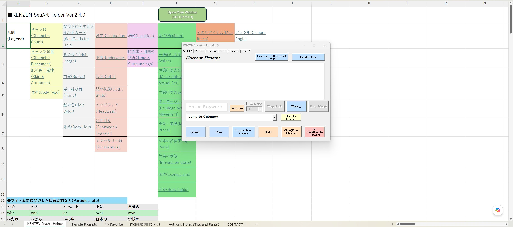

## 🚀 【v3.1.0 リリース！】 🚀
## 「NUKE!」ボタン新設！
しばらく使っていると、自分でも何が何だか分からなくなってきます。ソースは作者。そんな時、「全てをリセットしたい！」と思う事もあるかと思います。よって、文字通り全てのデータを初期値に戻す、「NUKE!(All Reset)」ボタンを新設しました。
## バグフィクス
・プロンプトソートの挙動改善。
・エクスポート機能において、「LoRA固有のネガティブプロンプト」が、エクスポートされない。
・ネガティブプロンプトのプリセットを呼び出して、リスト内に展開する際、まとめて重み付けされたタグが正しく格納されない。

この3点のバグを修正しました。いや、スマンカッタ（土下座）。

**もしこのツールが、あなたの素晴らしき創作の旅の役に立ったなら、このリポジトリに** **⭐****Star** **を押していただけると、作者にとってこの上ない励みになります！** 共に「KENZEN」な文化を広めていきましょう！

# ■KENZEN SeaArt Helper マニュアル（v3.1.0）

オフラインマニュアルは、[こちらをご覧下さい](KENZEN_SeaArt_Helper_Manual_v3.1.0.pdf)

**要約：****SeaArt****（＆****Stable Diffusion****）での、****NSFW****絵の生成プロンプト構築と管理に特化したツールです。****API****キーを使って、****Gemini****に****NSFW****絵のプロンプトを考えさせることもできます。**

## 1.はじめに

当Excelブックにはマクロを使用しております。

コーディング支援： Google Gemini（実質的な実装担当という名の丸投げ）

透明性の確保： Alt+F11 でVBAエディタを開き、\[標準モジュール\] 内の MainCode を参照・改変いただけます。（※悪意あるバックドアは仕込んでいませんが、Google Geminiの言いなりで煮込まれたスパゲッティコードが内包されています）

著作権： 放棄しませんが、改変および再配布は自由です。報告も不要です（あると作者が喜びます）。

## 2．作成目的

SeaArtでの「NSFW絵に特化した」プロンプト作成を劇的に効率化するために開発しました。 AIへの意図を正確に伝えるための、英語プロンプト構築ツールです。「自分用に使いやすいものを！」という情熱と性癖を詰め込みました。「ダメ英語」の落とし穴を回避しつつ、最短ルートで理想の出力を目指します。……全き！　健全（KENZEN）ですよ！

## 3.マクロの主要機能（安全設計）

### 3-1全角チェック

日本語（全角文字）が含まれている場合、コピーを停止し警告音で知らせます。

### 3-2.自動連結

2回目以降のコピー時、自動的に “, “（カンマ＋半角スペース）を挿入して追記します。

### 3-3.リアルタイム表示

構築中のプロンプトは「Current Prompt」フィールドに常時表示されます。

### 3-4.リセット機能

Clear ボタンでクリップボードと画面表示内容を消去します。

## 4．使用準備

### 4-1ブロック解除

ダウンロードしたxlsmファイルを右クリック → プロパティ→ 「許可する」にチェックを入れて保存。

### 4-2マクロ有効化

ファイルを開き、上部の「コンテンツの有効化」をクリック。

### 4-3 JSONファイルについて

同梱されている「`KENZEN_Config.json`」は、必ず、.xlsmファイルと同じフォルダに置いて下さい。

## 5．検索パネルと操作方法

起動する（マクロを有効化する）と、メインウィンドウが開きます。もし、KENZEN_Config.jsonが同一フォルダにない、あるいは壊れている場合は、新たに生成されます。メインウィドウは、右上の×で閉じてしまっても、Open Main Window、あるいは、ショートカットキー Ctrl + Shift + O から、いつでも開けます。また、最小化して、デスクトップの左下隅に追いやる（？）こともできます。だって、ヴァチクソに広大なデータベースの一覧見る時に、ウィンドウが邪魔でしょう？

ウィンドウは、「Cockpit」、「Positive」、「Negative」、「LoRA」、「Favorite」、「Gacha!」、「I/O」の7つのタブ（パネル）で構成されています。

### 5-1「Cockpit」タブ

プロンプトを構築していくためのメニューがあるタブです。

#### 5-1-1.「Current Prompt」

ここに、現在のクリップボードの内容が表示されます。プロンプトをコピーするたびに、追記されていきます。テキストフィールドなので、手動での微調整も可能です。

#### 5-1-2．検索ボックス（Enter Keyword）

フィールドにキーワードを入力し、エンターキー、ないしは「Search」ボタンをクリックすると、メインシート内を検索できます。ヒットすると、セルが黄色く光り、右隣のプロンプトのセルに移動します。英語で検索した場合は、その場にとどまり、移動しません。連続ヒットする場合、Enterを押すごとに次の結果へループ移動します。

#### 5-1-3.「Jump to Category」コンボボックス、「Back to Legend」ボタン

プルダウンで、各カテゴリの見出しセルへ飛びます。項目の列の最後に、「凡例に戻る」のハイパーリンクがあるのですが、これも、下までスクロールするのも面倒だ！　というときに、「Back to Legend」を押すと、凡例に戻ります。

#### 5-1-4.「Copy」ボタン

コピーしたいプロンプトのセル上でクリックすると、クリップボードに転送されます。コピーを繰り返すと「Current Prompt」フィールドに、「, 」（カンマと半角スペース）を付けて、プロンプトが蓄積されます。「BREAK」に関しては特殊で、前後に改行が入ります。なお、何らかの都合でクリップボードがロックされてしまっていても、リトライする設計になっています。

#### 5-1-5.「Copy without comma」ボタン

カンマなし（半角スペースのみ）で連結します。oversized tank top 等、連結して一つの概念を指す場合に有効です。マクロは、「最初を除き、コピーされる単語の頭に、カンマと半角スペースを付ける」挙動をします。なので、例えば、「”1 girl”  “is going to” “the park”“with” “me”」の場合は、まず、「1 girl」で通常コピー、次に「is going to」でカンマなしコピー、次の「park」でカンマなしコピー、その次の「with」でも、カンマなしコピー……と、「次にカンマを入れるべき所」（例の場合は「me」）まで、カンマなしコピーをしてください。次のプロンプトを通常コピーすれば、区切りに「, 」が付きます。なお、最初のプロンプトを、このボタンでクリックしても、先頭にスペースは入りません。

#### 5-1-6.「Undo」ボタン

操作を戻せます。50回まで可能です。クリップボードの内容も、元に戻ります。

#### 5-1-7.「Clear」ボタン

クリップボードと「Current Prompt」フィールドを消去します。アンドゥは可能です。

#### 5-1-8．「All Clear」ボタン

クリップボード、「Current Prompt」フィールド、及び全ての履歴を完全に消去し、リセットします。アンドゥはできません。（通称：Nuke / 物理的更地化ボタン）

#### 5-1-9．重み付け機能（「Weight」チェックボックス＆「Wrap Block」ボタン）

強調したい（あるいは弱めたい）プロンプトを、0.5～1.3まで重み付けできます。一つの単語はもちろん、例えば、先ほどの「oversized + tank top」といった、2単語以上の組み合わせも、「(oversized tank top:1.1)」のようにできます。「Wrap Block」を押すと、その前のカンマまでのブロックを「()」でくくって、重み付けします。もちろん、1つのプロンプトにも有効です。誤操作防止と、AIへの負荷軽減のために、一度「Weight」ボタンをクリックすると、チェックボックスはオフになります。また、プロンプトを追加しないで、もう一度チェックをオンにして「Wrap Block」をクリックすると、重み付けが解除されます。

#### 5-1-10.「Wrap \[ \]」ボタン

BREAK構文を使う際、人物ごとの要素丸ごとを”\[\]”でくくると、AIの理解がよくなります。（使用するモデルによるかもしれません）そんな時、テキストボックス内の範囲を選択し、このボタンを押すと、そのブロックが”\[\]”でくくられます。

#### 5-1-11.「Done!」ボタン

気が済むまで（？）手動での調整が終わったら、「Done!」をクリックすれば、現在のテキストフィードの内容がコピーできます。

#### 5-1-12. 「Everyone, Fall in! (Sort Prompt)」ボタン

長大な呪文を構築していると、「要素を入れ忘れる」ことがよくあります。順番がバラバラでも、AIは理解してくれますが、やはり揃っていた方がいい。このボタンを押すと、データベースの項目順に、プロンプトがソートされます。ただし、BREAK構文を使った際は、最後の段落に対してのみ適用される仕様なので、そこはご注意を。

#### 5-1-13.「Cleanup Prompt」ボタン

呪文の構築に試行錯誤していると、余計なカンマなどのゴミが混入することが結構あります。そのままでも深刻なエラーなどは起きないとは言え、美しくない。このボタンを押すと、呪文の中に含まれている不要なカンマを掃除できます。

#### 5-1-14. Send to Favボタン

気に入ったプロンプトを、「Favorite」タブウィンドウのテキストフィールドに転送します。

### 5-2.「Positive」タブ (AIは言われたことしかしない)

基本的に怠け者であるAIを、きちんと働かせるためのポジティブプロンプトを、効率的に管理・運用するための専用画面です。

#### 5-2-1.Your Positive Stock / ポジティブプロンプト貯蔵庫

ウィンドウ左側のリストボックスです。現在登録されている、ポジティブプロンプトが一覧できます。初期状態で、デフォルトがセットされています。これを、足したり引いたり、割ったり掛けたり（？）するわけです。Ctrlキー、Shiftキーを押しながら、あるいはマウスドラッグでの、複数選択も可能です。

###### 5-2-1-1.Selected Deleteボタン

ストックデータのうち、選択されたものを削除します。元データも消えます。

###### 5-2-1-2.Delete Allボタン

全てのストックを削除します。元データが全て消えるので、ご注意を。

##### 5-2-2 Applied Positive List  / 現在の適用リスト

ウィンドウ右側のリストボックスで、ポジティブプロンプトとして出力したい精鋭ども（？）の場所です。こちらも、複数選択可能でし。でし？

###### 5-2-2-1.Select Allボタン

リスト内を全選択します。まとめてプレビュー欄に送るときに。

###### 5-2-2-2.Dismiss Allボタン

適用するつもりだった言葉全てを却下（消去）します。元データには影響しません。

##### 5-2-3.▲/▼ ボタン

2つのリストボックス横にあるボタンです。見たまんまで、リスト内の順番をソートします。ただし、エラー防止の観点から、動かせるのは1つずつになります。左側のストックは、元データの順番も変わりますが、右側は影響しません。

##### 5-2-4.→/←ボタン

これも見たままですが、「→」は、ストックから選択した項目を適用リストへ送り、「←」は、適用するつもりだった言葉を戻し（却下）します。元データには影響しません。

##### 5-2-5.Add to Positive Previewボタン

選択されたタグを、ウィンドウ下部の「Preview」のテキストボックスへ送ります。複数選択した場合は、「, 」（カンマと半角スペース）で区切られて出力されます。

##### 5-2-6.Set as Positive Defaultボタン

Previewウィンドウの内容を、デフォルトのポジティブプロンプトとして登録します。

##### 5-2-7.Save as Positive Presetボタン

Previewウィンドウの内容を、プリセットとして登録します。

##### 5-2-8.Add New Positive Stock? テキストボックス/ Add New Positive Stockボタン/Clear Positive Stock Inputボタン

新しいポジティブプロンプトを登録する場合、ここへ入力して、エンターキーか、「Add New Positive Stock」ボタンを押せば、左側のストックリストボックスに追加されます。カンマ区切り、タブ区切り、改行区切りでも、整形して登録できます。Clear Positive Stock Inputは、単純にテキストボックス内をクリアします。

##### 5-2-9.Previewボックス

先に触れましたが、実際のポジティブプロンプトが表示されます。直接入力による編集も可能です。

##### 5-2-10.Send to Cockpitボタン/Clear Positive Previewボタン

Previewに表示されているポジティブプロンプトを、Cockpitのメインテキストウィンドウへ転送します。この操作は、ショートカットキー「Ctrl＋Shift＋P」でも可能です。Previewウィンドウに何も入っていないと、エラーが出ます。Clear Positive Previewボタンは、Previewウィンドウをクリアします。

##### 5-2-11.Positive Presetコンボボックス/ Call Posi Presetボタン/ Delete Posi Presetボタン

プルダウンから登録したポジティブプロンプトのプリセットを選択し、「Call Preset」で呼び出します。Delete Posi Presetでの削除もできますが、Defaultは削除できません。

### 5-3.「Negative」タブ (絶許ブラックリスト)

AIの「暴走」を食い止めるためのネガティブプロンプトを、効率的に管理・運用するための専用画面です。基本的に、ポジティブプロンプトの管理画面とシンメトリーになっていますが、細かくは違います。

##### 5-3-1.Your Negative Stock / ネガティブプロンプト貯蔵庫

ウィンドウ左側のリストボックスです。現在登録されている、ネガティブプロンプトが一覧できます。初期状態で、デフォルトがセットされています。

###### 5-3-1-1.Selected Deleteボタン

ストックデータのうち、選択されたものを削除します。元データも消えます。

###### 5-3-1-2.Delete Allボタン

ポジティブプロンプトの管理画面同様、全てのストックを削除します。元データが全て消えます。

##### 5-3-2 Applied Negative List  / 現在の適用リスト

ポジティブプロンプトの管理画面と同様です。

###### 5-3-2-1.Select All / Dismiss Allボタン

ポジティブプロンプトの管理画面と（以下同文）

##### 5-3-3.▲/▼ ボタン

ポジティブプロンプトの管理（以下略）

##### 5-3-4.→/←ボタン

ポジティブ（略）

##### 5-3-5.Add to Negative Previewボタン

ポジ（略）

##### 5-3-6.Weighting チェックボックス、コンボボックス、Weighten and Add to Nega Previewボタン

Cockpit画面同様に、チェックボックスをオンにするとコンボボックスが開くようになり、ネガティブプロンプトを重み付けできます。やはり、0.5～1.3までです。

##### 5-3-7.Add New Negative Stock? テキストボックス/ Add New Negative Stockボタン/Clear New Negative Stock Inputボタン

同じ事を説明させるな！（突然の逆ギレ）

##### 5-3-8.Previewボックス

特に説明はいらないかと。

##### 5-3-9.Copy Negative Preview/Clear Negative Previewボタン

テキストボックスのネガティブプロンプトを、クリップボードにコピー、あるいは、Previewボックス内を消去します。

##### 5-3-10.Negative Presetコンボボックス/ Call Nega Presetボタン/ Delete Nega Presetボタン

ポジティブプロンプトの同機能と同じです。

### 5-4.「LoRA」 タブ（LoRAの鍛冶場）

品質向上に必須となる &lt;lora:hash(sys name):strength&gt; 形式のプロンプトと、それに付随するトリガーワードの組み合わせを視覚的かつ直感的に構築・管理します。

（LoRAが一つも登録されていない場合は、安全のためUIがロックされています。「Open LoRA Manage Window」からLoRAを登録してください）

##### 5-4-1. Use LoRA チェックボックス

このタブの機能の有効/無効を切り替えます。

##### 5-4-2. Open LoRA Manage Window ボタン

LoRAのシステムハッシュやトリガーワードを登録・管理する専用ウィンドウ（後述）を開きます。

##### 5-4-3. LoRA Selection & Strength (LoRAの選択と強度)

登録済みのLoRAをプルダウンから選択します。選択すると、推奨の強さ（Strength）と登録されたトリガーワードが自動的に展開されます。

##### 5-4-4. Trigger Words チェックボックス

展開されたトリガーワードから、今回使いたいものだけにチェックを入れます（デフォルトで全てONになる親切設計です）。トリガーワードがないLoRAに関しては、出てきません。

##### 5-4-5. Set! & Cancel ボタン

「Set!」を押すと、選択したLoRAとトリガーワードが右側のリストボックス（カート）に入ります。「Cancel」は選択状態を白紙に戻します。

##### 5-4-6. Your Selected LoRA (Cart)

現在セットされているLoRAのリストです。複数重ね掛けしたい場合は、さらに別のLoRAを選択して「Set!」を押すことでどんどん追加できます。

##### 5-4-7. Wrap LoRA! ボタン & Weight (プロンプトの錬成)

カートに入っている「選択されたLoRAの」トリガーワードを、&lt;lora:Hash(sys name):strength&gt;,(Trigger word:1.x)の形式に整形し、Preview欄に出力します。トリガーワードの重み（Weight）が1.0の場合は、「()」でくくられません。ただし、「同じLoRAの、複数あるトリガーワードに、それぞれ違う重み付けをしたい」場合には、Previewテキストボックスを手動で編集してください。

Ÿ   *Safety Feature:* 万が一、大元の管理データから削除された「幽霊LoRA」がカートに残っていた場合、このボタンを押した瞬間に自動検知してカートから除霊（削除）します。

##### 5-4-7-1.Wrap with Hash / Wrap with Nameオプションボタン

選択したLoRAを&lt;lora:…&gt;の形で成形する際、ハッシュ値で括るか、システム名で括るかを選択できます。SeaArtはハッシュ値で、Stable DiffusionのWebUIでは、名前で括った方がいいから、という理由で実装しました。

##### 5-4-8.Get LoRA Negative ボタン

固有のネガティブプロンプトを持っているLoRAをリスト以内で選択すると、押せるようになり、そのLoRAのネガティブプロンプトが、「Negative」タブのPreview欄に展開されます。

##### 5-4-9. Remove / Forget LoRA ボタン

「Remove」は選択したLoRAをリストから1つ除外します。「Forget」はカートとプレビューを完全にクリアして最初からやり直します。

##### 5-4-10. Send to Cockpit / Send to Fav /Clear Previewボタン

Preview欄に完成したLoRAプロンプトを、Cockpitタブ（またはFavoritesタブ）のテキストフィールドへ転送します。Clear Previewボタンは、単純に、Previewテキストボックスをクリアします。

##### 5-4-11. Preset (プリセットの保存と呼び出し)

「Save as Preset」で現在のLoRAの組み合わせ（リストの中身と重み）に名前を付けて保存できます。「Call Preset」でいつでも一発で呼び出し、「Delete Preset」で削除します。よく使う衣装や画風の組み合わせを保存しておくと劇的に時短になります。

### 5-5. 「LoRA Register & Manage」タブ (LoRAの金庫)

LoRAの実データ（ハッシュ値、トリガーワード、固有のネガティブプロンプト）を登録・管理する心臓部です。「LoRA」タブの「Open LoRA Manage Window」からアクセスします。

#### 5-5-1. LoRA Alias / Model Name/ System Hash / Recommended Strength:

 - Alias: あなたが識別しやすい任意の名前（例：JK制服、水彩画スタイル）。

 - Model Name：.safesensorファイルを読み込ませた際に、ファイルから取得された、そのLoRAの正式なシステム名です。自動で入力され、編集はできません。

 - System Hash: SeaArt等で実際に使用されるハッシュ値です。フィールドをダブルクリックすることで、.safesensorファイルの参照ウィンドウが開き、LoRAのファイルを指定すると、自動で AUTO V2形式のハッシュ値が取得できます。

*Note**：*SeaArtでのハッシュ値とは？

SeaArtのサイトの、各LoRAの詳細ページを開いたときのURLの、

https://www.seaart.ai/ja/models/detail/40095be8759dde4285ccf683b24e8852

例えば上記のLoRAの場合、「/detail/」以降の文字列「40095be8759dde4285ccf683b24e8852」が、ハッシュ値です。

 - Recommended Strength:そのLoRAの、強さの推奨値

 - *Auto-Sanitize:* Hash入力欄に全角文字や不正な記号を入れても、自動的に半角の安全な文字に浄化される鉄壁のガードマンが常駐しています。

#### 5-5-2. LoRA Trigger Word / None チェックボックス:

そのLoRAを発動させるためのトリガーワードを入力します。複数ある場合はカンマ区切りで入力可能です。

*Note:*トリガーワードは最大10個まで。大文字・小文字を区別しない重複チェックが行われ、プロンプトに有害な記号（! ? @ # ( ) など）はエラーで弾かれます。

トリガーワードが不要なLoRAの場合は「None」にチェックを入れてください。

#### 5-5-3.LoRA’s Negative Promptsフィールド / Noneチェックボックス

固有のネガティブプロンプトを持っているLoRAの場合、それらを一括して登録できます。登録したプロンプトは、メインウィンドウの「Negative」タブの、「Get LoRA Negative」ボタンから呼び出せます。

#### 5-5-4. Register / Cancel / Update LoRA ボタン

入力した内容を登録します。トリガーワードが増えた、あるいはなくなったなど、既存のLoRAを編集（Manage）している最中は、ボタンが「Update LoRA」に変化し、変更がない場合は無駄な上書きを防ぐダーティチェック機能が働きます。

#### 5-5-5. Registered LoRA List & Sort ボタン (▲ / ▼)

登録済みのLoRA一覧です。「▲」「▼」ボタンを使って、よく使うLoRAを上に固めたり、カテゴリごとに並べ替えたりと、リストを自由に整理できます。ここでの並び順は、メイン画面のプルダウンにも連動します。

#### 5-5-6. Manage / Delete LoRA ボタン

リストから選択したLoRAを編集（Manage）、または完全に削除（Delete）します。

### 5-6.「My Favorite」タブ（性癖の金庫室）

苦心の末に（？）作り上げた、大切なプロンプトを管理するためのメニュー類があるタブです。なお、このタブのボタンは全て、「My Favorite」タブがアクティブになっていないと、動作しません。

#### 5-6-1.「Search Fav」フィールド、「Search Fav」ボタン＆「Clear Search」ボタン

フィールドにキーワードを入力して、エンターか「Search Fav」ボタンのクリックで、「My Favorite」シート内を検索できます。検索されるのは「Description」のフィールドのみで、メインシートでのそれ同様、ヒットしたセルが光り、複数ヒットした場合は、ループします。Clear Searchは、単純に、検索ボックスだけを消去します。

#### 5-6-2.「Pull From Cockpit」ボタン

「Cockpit」タブのテキストフィールドに入力されているプロンプトを転写します。

#### 5-6-3.「Send to Cockpit」ボタン

上記とは逆に、Favorite Promptのテキストフィールドの内容を、Cockpitのフィールドへ送ります。お気に入りを、メインシート内のプロンプトを加えることで、更にブラッシュアップするときに。

#### 5-6-4.「Open Favorite Manage Window」ボタン

お気に入りの管理画面（後述）を開きます。

#### 5-6-5.「Copy Fav」ボタン

「My Favorite」シート上のお気に入りをコピーします。やっぱりね、気に入った呪文は、何度でも使いたいですよね。「コピーされた呪文（プロンプト）は、説明と共にテキストフィールドに表示されます。（説明なしで呪文だけ見て、すぐに思い出せる人も、まずいないでしょう？）

#### 5-6-6.「Tweaked!」ボタン

コピーしたお気に入りプロンプトを、テキストフィールド内にて、さらに手動で調整した後、クリック可能になり、クリックすると、テキストフィールドの内容がコピーされます。

#### 5-6-7.「Add to Fav!」ボタン

フィールド内のプロンプトを、「My Favorite」シートに登録します。「Description」が空欄だと、エラーを吐きます。最大50件まで登録できます。

#### 5-6-8.「Replace Fav」ボタン

「My Favorite」シートの中で、フォーカスされているセルのプロンプトを、（「Favorite」タブの）テキストフィールドの内容と置換します（セルが空欄ならば、そのまま入力されます）。プロンプトが入っていないセル上でクリックしても、エラーが出ます。例えば、「Favに登録したプロンプトに、新しく要素を追加したら、もっとよくなった！　でも、お気に入りの中に似たものがダブるのは困る！」という場合に使えます。

#### 5-6-9.「Clear Prompt & Description」ボタン

単純に、プロンプトと説明のフィールドをクリアします。

#### 5-6-10.「Undo Fav」ボタン

Cockpit同様、テキストフィールドの内容をアンドゥします。

### 5-7. Favorite Manageウィンドウ（コレクションは整理しましょう）

登録されているお気に入りを管理するウィンドウです。

#### 5-7-1.Your All Favoritesリストボックス/▲▼ボタン

全てのお気に入りが、リスト化されて一覧表示されます。▲▼ボタンでソートできます。

#### 5-7-2.Full Description ボックス

リストで選択したお気に入りの、説明全文が表示されます。

#### 5-7-3.「Send to Fav Window」ボタン

選択されたお気に入りを、Favoriteタブのテキストフィールドへ転送します。リスト内をダブルクリックしても、同じ挙動をします。

#### 5-7-4.「Delete Selected Fav」ボタン

選択されたお気に入りを削除します。複数選択でも可能です。

#### 5-7-5.「All Delete Fav」ボタン

全てのお気に入りを削除します。元には戻せませんので、くれぐれもご注意を。

### 5-8. 「Gacha!」タブ（AIお任せ・プロンプト錬成）

Google Gemini APIを活用した、AIによるプロンプト自動生成機能です 。緻密で複雑な呪文（プロンプト）の構築にうん☆ざりした時の「純粋な息抜き」として、AIの想像力に身を委ねてみるのも、また一興かと。文字通り、「何が出るかな？」の、「ガチャ」です。ちなみに、Geminiにある魔法（誇大表現）をかけてありますので、NSFW絵のプロンプトも、しっかり練成してくれます。ただ、「一発アウト」な地雷ワードもあります。詳しくは、ブック内の「作者的覚え書き(ja)v3.0.0」シートをご覧ください。

#### 5-8-1. Google Gemini API Key

AIによる生成機能を利用するには、Google AI Studioにて各自でAPIキーを取得し、入力する必要があります。

- サポート対象外: APIキーの取得方法や設定に関する個別サポートは一切行いません。ご自身で解決できる「術師」の方のみご利用ください。作者も、そこまで面倒は見きれません（ぶっちゃけたー！）

 - AIの機嫌: Google Geminiは非常に「お行儀が良い」AIです。いかにNSFWなプロンプトを出力できる！　とは言え、その内容や（時々サービス精神を強く発揮する）AIの「機嫌（セーフティフィルタ）」次第では、出力が上手く行かなかったり、拒絶されたりすることがあります。それも含めての「ガチャ」としてお楽しみください。

 - APIキーの自動セーブ：一度Google Geminiによるプロンプト練成が成功すれば、それをフラグにして、入力されたAPIキーは、ローカルマシンのレジストリに記録され、次回からは自動で入力されます。APIキーが変わった場合は、上書きすれば、その時の実行（成功）時に上書きされます。

#### 5-8-2. 自然文入力欄（Please tell me your desire!）

あなたが思い描くシチュエーション(欲望)を、普段使っている言葉で自由に入力してください。

 - **バイリンガル対応****:** 日本語、英語、あるいはその混在であってもAIが内容を理解し、SeaArt等の生成AIに最適なタグセットへと昇華させます。

#### 5-8-3. 操作ボタン類

 - **Feeling Lucky?:** 入力された内容を元に、Geminiへリクエストを送信し、ガチャを回します。エラーでの返答もAPIの使用回数に含められるので、過度な連打はエラーの元＝無駄玉の消費に繋がります。よって、一度押したら、15秒間はグレーアウトします。ちなみにその間、誤操作防止のため、他のタブウィンドウへの移動もできなくなります。バグではなくて、仕様です（いにしえからの常套句）

 - **Clear:** 入力欄の内容をクリアします。

#### 5-8-4. 生成結果エリア（How about this?）

AIが錬成したプロンプトが表示されます。

- **Copy This!:** 生成されたプロンプトをクリップボードにコピーします。
- **Send to Cockpit / Send to Fav:** 生成されたプロンプトを「Cockpit」タブまたは「Favorites」タブへ転送します。お気に入りのLoRAを適用したりなど、お好みのままに。
- **Clear Result:** 生成結果を消去します。

#### 5-8-5. 「Trigger Happy?」フレーム（ガチャ残弾数）

本日の残りのガチャ実行回数を表示します。

 - **あくまで目安****:** 表示される回数は、一般的なGoogleの無料枠でのAPI制限回数と、本ツール内でのカウントに基づいた「目安」です。実際のGoogle APIの制限とは多少の誤差が生じる場合があります。

 - **リセット****:** カウントは太平洋時間（PT）の0時に合わせてリセットされます。

 - **リミット調整（隠し機能）****:** APIに課金しているヘビーユーザーが、上限設定を変更したい場合は、カウンターの数字部分をダブルクリックしてください。1日の上限回数を自由に調整できる入力ボックスが表示されます。

#### 5-8-6.「Surprise Me!」チェックボックス / SFW & NSFW & Hardcoreオプションボタン

チェックを入れると、3つのオプションボタンが出てきます。どれかを選んでから「Feeling Lucky?」を押すと、データベース内からランダムに抽出された単語を元に、Google Geminiがプロンプトを考えてくれます。

#### Tips：ガチャのコツ

欲望を語るときには、あなたまで「お行儀よく」する必要はないです。変な照れがあると、Geminiがそれを察知して、（小賢しい）安全フィルターを発動させるケースが、デバッグ中にありました。そうです。女性器を指す場合は、「股間」とか、オブラートに包まなくていいんです。素直に「ま○こ」と書きましょう。

### 5-9.「I/O」タブ（資産はきちんと保全しましょう）

コツコツ築き上げたプロンプトという資産を、JSON形式でバックアップ（エクスポート）や、レストア（インポート）する機能を集約したタブです。

 - **Positive Preset** **（ポジティブプロンプトのプリセット）**

 - **Negative Stock** **（ネガティブプロンプトのストック）**

 - **Negative Preset** **（ネガティブプロンプトのプリセット）**

 - **LoRA Base Data** **（LoRA** **の基本データ）**

 - **LoRA Preset** **（LoRA** **のプリセット）**

 - **Favorite** **（お気に入り）**

以上6つのデータが対象です。デフォルトでは全てにチェックが入っていますが、「Check All」ボタンを押すと、選択解除と全選択が切り替わります。「Export as JSON」でエクスポート、「Import from　JSON」で、インポートします。そのままだ！

#### 5-9-1.Add(Marge)/Overwrite(Replace)オプションボタン

既存のデータに追加（マージ）するか、上書き（置換）するかを選択できます。なお、Favorite（お気に入り）を追加モードでインポートした際、合計50件を超えた分に関しては、あふれた分を、別のJSONファイルに保存できます。

#### 5-9-2.「Legacy CSV to JSON」ボタン

V2.xまでを使っていた方々への機能です。旧バージョンで作成したFavoriteとLoRAのCSVファイルを、v3.0.0で扱えるJSONファイルにコンバートします。

#### 5-9-3.「NUKE!(All Reset)」ボタン

全てのデータを初期状態に戻します。上書きして消す挙動をするので、アンドゥなどはできません。くれぐれもご注意ください。

## 6\. プロンプトの構築フロー

薄緑色のセルを左から順に選んでいくだけで、一つの完成されたプロンプトになります。

キャラ数(Character Count) → キャラの配置(Character Placement) → 肌の色・属性(Skin & Attributes) → 体型(Body Type) → 髪の毛に関するワイルドカード(Wildcard For Hair) → 髪の長さ(Hair length) → 前髪(Bangs) → 髪の結び目(Tying) → 髪の色(Hair Color) → 体毛(Body Hair) → 職業(Occupation) → 下着(Underwear) → 服装(Outfit) → 服の状態(Outfit State) → ヘッドウェア(Headwear) → 足元周り(Footwear & Legwear) → アクセサリー類(Accessories) → 場所(Location) → 時間帯・周囲の状況(Time & Surroundings) → 体位(Position) → 行為・動作(Action & Movement) → ボンデージ行為(Bondage Action & Movement) → 手段・道具(Means & Props) → 身体の部位(Body Parts) → 行為の状態(Interaction State) → 表情(Expressions) → 体液(Body fluids) → その他アイテム(Misc Items) → アングル(Camera Angle) → 修正その他(Censorship Fixes & Others)

Stable Diffusionのローカル環境で、Dynamic Promptの拡張機能を使用している場合、髪の毛、表情、アングルについては、ワイルドカードを用意しています。ZIPファイル内に同梱していますので、ご活用下さい。

メインシートの冒頭には、各項目のセルへ飛ぶハイパーリンクが設定しており、クリックするとジャンプし、フォーカスの移動したセルは、自動的にウィンドウの左端に寄ります。

## 7\.「Sample Prompts」（サンプルプロンプト）シート

作者お気に入りのシチュエーションを収録しています。性癖の開示！（電波）サンプルをコピーすると、「Cockpit」タブウィンドウのテキストボックスにも同時に転送されるので、自分で調節して、オリジナルのプロンプトを作る事も出来ます。

## 8\.「作者覚え書き(ja)v3.1.0 / Author's Notes v3.1.0」シート

プロンプトに関するTipsとか、このマクロを作るに当たっての苦労話とかを書いています。息抜きにどうぞ（？）

## 9\.「CONTACT」シート

このREADMEにも書いていますが、作者の連絡先ブログなどを記載しています。

## 10\. 免責事項・連絡先

 - 生成結果はAI次第です。当ツールの使用によるいかなる損害についても、作者は一切の責任を負いません。

 - 同じく、「Gacha!」の機能についても、NSFWなプロントの、確実な出力を保証するものではありません。

 - 検証モデル：[REED_XXX_illustrious_SDXL V14.0](https://civitai.red/models/1717562/reedxxxillustrioussdxl)

 - 作者：不二川巴人（ふじかわ ともひと）（「でぇすて」とか、「不二川“でぇすて”巴人」名義で、エロゲーライターをやっていました）

 -  [連絡先・ブログはこちら。](https://dsblog.biz/)

 - リクエストや感想、あるいはバグレポートは、ブログのメールフォームまで。[投げ銭（PayPal）](https://paypal.me/dst0508https:/paypal.me/dst0508)も歓迎です！

 - バグレポートももちろんですが、「こんなロケーションが抜けてるぜ！」とか、「この服がないぞ！」というフィードバックは、是非ともお寄せください。自分好みに自由に改変できるとは言え、「未知のシチュエーションを、俺も見たい！」からです！　あなたの意見が、このマクロをよりKENZENにします！

 - （おまけ）[SeaArtの個人ページ](https://www.seaart.ai/ja/user/4b23d22e331a382c4adc23a3df4e7077?u_code=XWACJSXI)では、生成したイラストを元に、書き下ろしショートショートを投稿したりしています。よろしければ、そちらもどうぞ。

**さあ！　健やかなる()AIライフを！😊**

